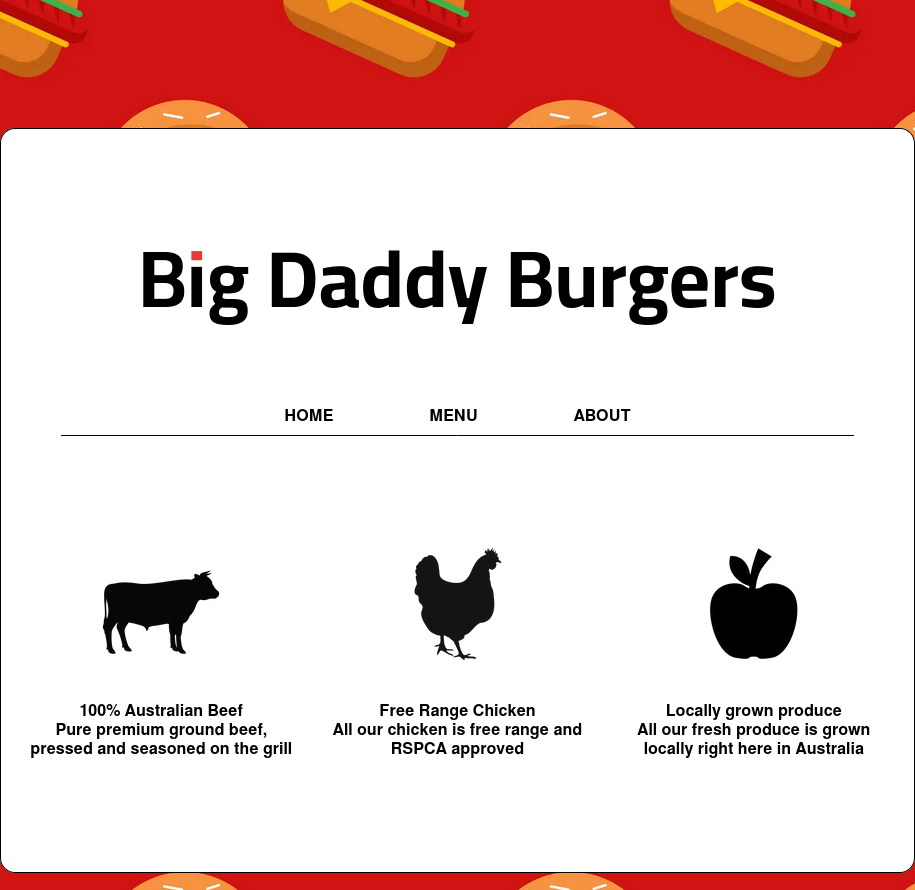
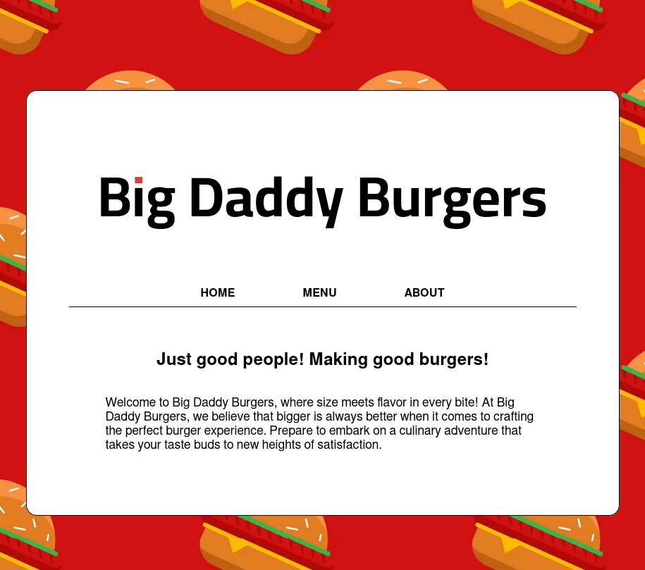

# The Odin Project: Restaurant Page
Creating a restaurant page with modular menus using javascript/npm/webpack

## Live Site
  

## Built With
-    
-    
- 

## Tools Used
- 
-  
- 
- 
- 
- 
- 

## Screenshots

